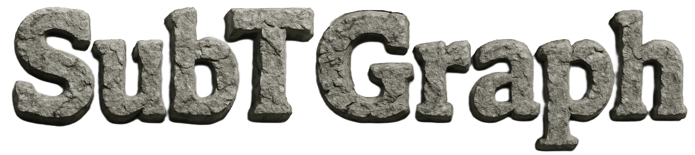
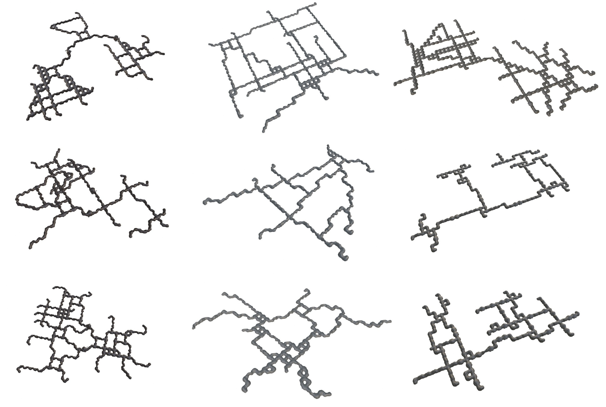
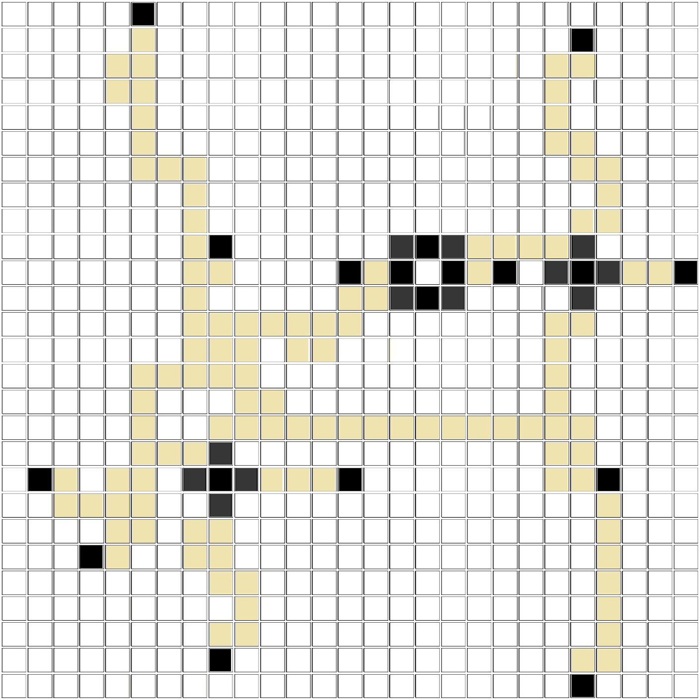
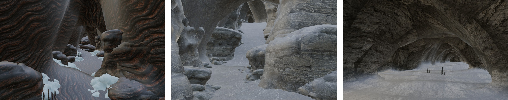

<p align="center">
  
</p>
<p align="center">
  
</p>

This is the code repository of SubTGraph, a subterranean world generator for statistical evaluation of robotic techniques. This tool is governed by the user-specified configuration that allows the creation of object meshes with different levels, topologies, textures, widths and lengths.

## Installation
The repository can be installed as a standalone Python package or deployed as a Docker container.

### Python package
This method of installation allows the user to work in a Python environment by simply installing the package. The definition of the package includes all required dependencies that the code utilizes.
```
# Clone repository
cd ~ & git clone https://github.com/fernand0labra/rai-subtgraph.git

# Install package
cd ~/rai-subtgraph & python3 -m pip install -e .  --config-settings editable_mode=compat
```

### Container deployment
Docker allows for any machine and operative system to execute this tool by simply pulling an image. All dependencies are included and the repository is mounted during runtime to allow configuration changes.
```
# Pull image from Docker Hub
docker pull fernand0labra/rai-subtgraph:latest

# Clone repository
cd ~ & git clone https://github.com/fernand0labra/rai-subtgraph.git

# Start container "subtgraph"
bash ~/rai-subtgraph/docker/docker.sh

# Connect to container terminal
docker exec -it subtgraph bash
```


## Subterranean World Generation
The generation of the meshes is performed with the spawn of structural constraints i.e. loops, junctions and intersections. These constraints are satisfied by a set of objective nodes. Between each (constraint, node) pair a linear, parabolic or sine route description is applied to build a cost matrix. For every cost matrix, Dijkstra is applied and all paths are summed into the visitation matrix.

The visitation matrix, composed of (0,1) is transformed into an object-level matrix with each occupied tile being a speficic asset object e.g. corner, straight corridor, junction, etc. Finally, a recursive process is followed from an initial objective node to build the .obj mesh by applying horizontal and vertical offsets while importing the individual tile assets.


### User Configuration
The generation process is governed by the user-specified YAML configuration under [*config/generation*](/config/generation/). Four configuration files are available to the user: Custom, natural, operational and lavatube configurations. To specify the desired configuration the following path has to be changed in [*src/utils.py*](/src/utils.py).

```
# src/utils.py
with open('../config/generation/custom.yaml', 'r') as file:
    config = yaml.safe_load(file)
```

The initial basic configuration that can be chosen in the YAML file is the repository path, the random generation seed and the number of generated worlds that want to be generated.
```
repository_path: '/home/fernand0labra/rai-subtgraph'

generation_seed: 11
generation_n_worlds: 1
```

#### Level Visualization & Selection
TODO
```
generation_level_control: True
```


#### Asset Selection
```
generation_tile_type: 'b'

env_asset_list_type_a:
  ...
env_asset_list_type_b:
  node: 
    parameters: 'node'
    assets: [
      "cave_corner_01_type_b",
      ...
    ]

  corner:       
    parameters: 'corner,e,s'
    assets: [
      "cave_corner_01_type_b",
      ...
    ]

  straight:     
    parameters: 'straight,e,w'
    assets: [
      "cave_straight_01_type_b",
      ...
    ]

  shaft: 
    parameters: 'shaft,e,n,s,w'
    assets: [
      "cave_vertical_shaft_type_b",
      ...
    ]

  junction:     
    parameters: 'junction,e,n,s'
    assets: [
      "cave_3_way_01_type_b"
    ]

  intersection: 
    parameters: 'intersection,e,n,s,w'
    assets: [
      "cave_4_way_01_type_b",
    ]
```

#### Mesh Storage & Reconstruction
TODO
```
generation_save_folder: 'data'
generation_load_folder: 'data/subtgraph_2025-07-28_14-31-05'

generation_load_matrix: False
generation_save_matrix: True
generation_save_mesh: True
```

#### Constraint Definition
TODO
```
generation_topology: 'sine'
generation_route_harmonic: -1

world_n_levels: [1, 1]                          
world_n_loops_per_level: [0, 2]                 
world_n_tjunctions_per_level: [0, 2]           
world_n_intersections_per_level: [0, 2]    
```


#### Dimension Controllability
TODO
```
world_max_width:  [50, 100]
world_min_length: [1000, 1000]
```


#### Texture Definition
TODO
```
texture_cave_wall: 'CaveWall_Natural.jpg'
texture_rock_pile: 'RockPile_Natural.jpg'
texture_striated_rock: 'StriatedRock_Natural.jpg'
```


## Tutorial Video


## Citation
