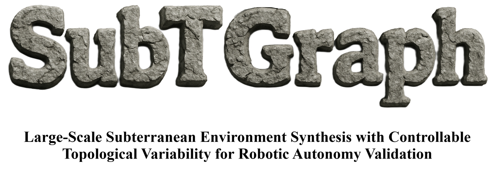
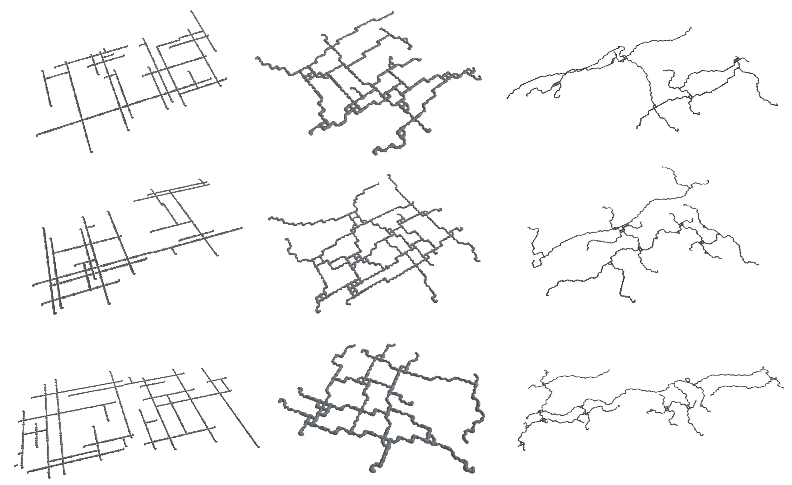
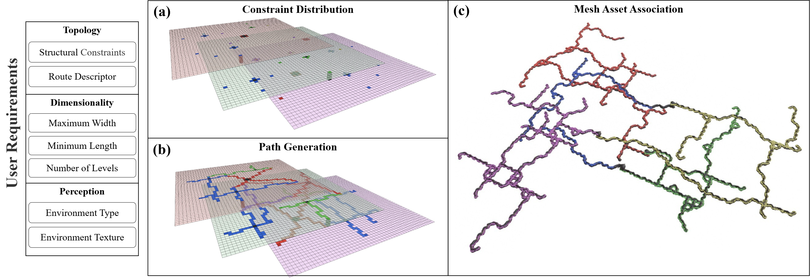
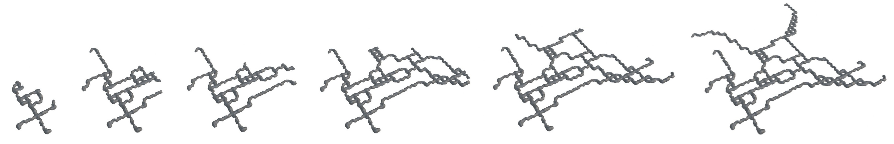
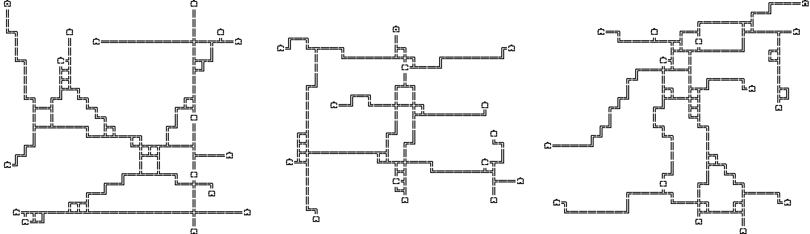
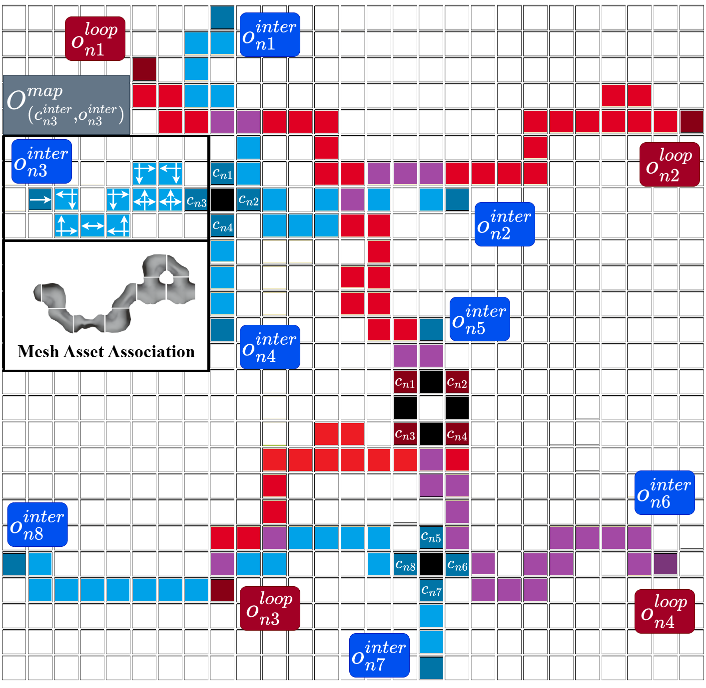
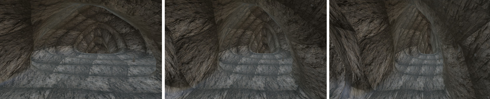

<p align="center">
  
</p>
<p align="center">
  
</p>

This is the code repository of SubTGraph, a subterranean world generator for statistical evaluation of robotic techniques. This tool is governed by the user-specified configuration that allows the creation of object meshes with different levels, topologies, textures, widths and lengths.

## Installation
The repository can be installed as a standalone Python package or deployed as a Docker container.

### Python package
This method of installation allows the user to work in a Python environment by simply installing the package. The definition of the package includes all required dependencies that the code utilizes.
```
# Clone repository
cd ~ & git clone --depth 1 https://github.com/fernand0labra/SubTGraph.git

# Install package
cd ~/SubTGraph & python3 -m pip install -e .
pip install bpy==4.0.0 --extra-index-url https://download.blender.org/pypi/
```

### Container deployment
Docker allows for any machine and operative system to execute this tool by simply pulling an image. All dependencies are included and the repository is mounted during runtime to allow configuration changes.
```
# Pull image from Docker Hub
docker pull fernand0labra/rai-subtgraph:latest

# Clone repository
cd ~ & git clone https://github.com/fernand0labra/SubTGraph.git

# Start container "subtgraph"
bash ~/rai-subtgraph/docker/docker.sh

# Connect to container terminal
docker exec -it subtgraph bash
```


## Subterranean World Generation
A set of topological, dimensional and perceptual parameters are controlled to generate distinct 2-dimensional topologies of varying dimensions with textures and patterns that resemble different types of underground worlds e.g.
natural caves, operational mines or lava tubes.

The process starts by setting a group of topometric constraints, namely intersections or T-junctions, and associating objective nodes to their ends. An optimization process estimates a path, by utilizing Dijkstra over a manipulated cost matrix that includes lower costs for specific shape patterns defined over a route descriptor.

<p align="center">
  
</p>

The generation is started by running the following command. This process utilizes the user requirements to create an initial 2-dimensional topology, which is visualized in the user terminal. For optimal interaction, it is recommended that the terminal view is zoomed out to the maximum. Thereafter, the uses can choose whether to keep the current topology or generate a new one. This prompt is given per desired number of levels. Once all topologies have been accepted, the process instantiates the world mesh.

```
cd src & python3 main.py
...
>> Press enter to continue, or type 'x' to remake this level: (? User Input)
```

The topology occupancy matrix is transformed into an object-level graph with each occupied tile being a speficic asset object e.g. corner, straight corridor, junction, etc. Finally, a recursive per-level association instantiates and offsets the mesh components from a list of available assets to create the final underground world.

<p align="center">
  
</p>


### User Configuration
The generation process is governed by the user-specified YAML configuration under [*config/generation*](/config/generation/). Four configuration files are available to the user: Custom, natural, operational and lavatube configurations. To specify the desired configuration the following path has to be changed in [*src/utils.py*](/src/utils.py).

```
# src/utils.py
with open('../config/generation/custom.yaml', 'r') as file:
    config = yaml.safe_load(file)
```

The initial basic configuration that can be chosen in the YAML file is the random generation seed and the number of worlds that want to be generated. The repository path needs to be updated to the folder where this repository has been cloned.

```
# config/generation/custom.yaml

repository_path: '/home/fernand0labra/SubTGraph'   ### !!! UPDATE WITH YOUR PATH!!!

generation_seed: 11
generation_n_worlds: 1
```

#### Level Visualization & Selection
During the generation at each level, the user can define the following flag to visualize in the terminal the topology that has been randomly created and choose whether to keep or remake it. Three examples of terminal printed topologies are shown below.
```
# config/generation/custom.yaml

generation_level_control: True
```
<p align="center">
  
</p>


#### Asset Selection
This repository uses mesh assets from the [DARPA SubT World Challenge](https://subtchallenge.gazebosim.org/home). In a similar fashion as their [World Generator](https://github.com/osrf/subt/wiki/World-Creation-Tutorial), this tool utilizes **anastomotic (type 'a')** or **rectilinear (type 'b')** meshes. For each connection type (node, corner, junction, etc.) a selected subset has been considered and within this selection, the user can comment the specific meshes that should not be used. In this way, the controllability of the appearance of the mesh is allowed.

```
# config/generation/custom.yaml

generation_tile_type: 'b'

env_asset_list_type_a:
  ...
env_asset_list_type_b:
  node: 
    parameters: 'node'
    assets: [
      "cave_corner_01_type_b",
      ...
    ]

  corner:       
    parameters: 'corner,e,s'
    assets: [
      "cave_corner_01_type_b",
      ...
    ]

  straight:     
    parameters: 'straight,e,w'
    assets: [
      "cave_straight_01_type_b",
      ...
    ]
  ...
```

#### Mesh Storage & Reconstruction
The generation produces an .obj mesh together with three matrices describing the topology of the world, one of them being the visitation. The user can choose whether the .obj mesh should be built or not with the flag **generation_save_mesh**. In this way, the user can store the world as a matrix of 0s and 1s instead of a triangulated mesh of several GBs. 

The world can be then reconstructed onto an .obj mesh by indicating the folder where it is located **generation_save_folder** and the flags **generation_load_matrix**, **generation_save_mesh**. If the user only wants to visualize the world, set **generation_save_mesh** to False and **generation_level_control** to True.

It is also possible to not save the matrices with **generation_save_matrix**, but this would mean that only the mesh could be saved and no reconstruction can be performed.
```
# config/generation/custom.yaml

generation_save_folder: 'data'
generation_load_folder: 'data/subtgraph_2025-07-28_14-31-05'

## generation_load_matrix + generation_level_control -> Visualize topology of world
## generation_load_matrix + generation_save_mesh     -> Reconstruct .obj mesh
## generation_save_matrix + generation_save_mesh     -> Save both matrix and .obj mesh

generation_load_matrix: False    # Loading visitation matrix from generation_load_folder

generation_save_matrix: True     # Saving topology matrices
generation_save_mesh: True       # Saving .obj mesh
```

#### Constraint Definition
This tool functions by locating loops, junctions and intersections at different positions of the grid and satisfying their ends with objective nodes. The route that will be followed from each corner to its objective node will follow a harmonic signal with (0,1,2) nodes as specified by the user to respectively create linear, parabolic and sine routes.

All specified values work within ranges, if the user wants to specify a fixed value then [low, high] should have low = high. Otherwise a random value from within the range *random(low, high)* will be computed.
```
# config/generation/custom.yaml

generation_topology: 'sine'                # Define route description by name ('linear', 'parabolic', 'sine')
generation_route_harmonic: -1              # Define route description by harmonic (0: 'linear', 1: 'parabolic', 2: 'sine', 3, 4, 5, etc.)

world_n_levels: [1, 3]                     # Define range of levels
                          
world_n_loops_per_level: [0, 2]            # Define range of loops   
world_n_tjunctions_per_level: [0, 2]       # Define range of junctions   
world_n_intersections_per_level: [0, 2]    # Define range of intersections
```

The following image displays the effect of different structural constraints in the generation of an underground topology. Click on the image for a better resolution.

<p align="center">
  
</p>

#### Dimension Controllability
It is possible to control the dimensions of the mesh by specifying a range in which the world can be spawned. The grid of each level is computed as the square root of the length, ensuring larger topologies. However, bigger subterranean worlds need to include an increased number of constraints in order to satisfy that all routes are at some point connected.

The dimensionality is controlled by calculating a ratio between the specified user value (randomly obtained from within the range) and the actual dimensions of the mesh on their X and Y axes, respectively for width and length. This ratio is then applied to scale the mesh and allow width below the maximum specifed and length at least as minimum specified.
```
# config/generation/custom.yaml

world_max_width:  [50, 100]      # In meters
world_min_length: [1000, 1000]   # In meters
```

<p align="center">
  
</p>


#### Texture Definition
This tool allows for the definition of textures to each of the objects within a mesh. Each asset connection is composed of three objects, the "CaveWall", "RockPile", "StriatedRock". These objects can be textured from one of the images under [**assets/textures**](/assets/textures/), but the user can also specify their own. 

Depending on the requirements of the user, it is possible to not include the "RockPile" or "StriatedRock" if not desired by not indicating any texture '' for that particular object.

```
# config/generation/custom.yaml

texture_cave_wall: 'CaveWall_Natural.jpg'
texture_rock_pile: 'RockPile_Natural.jpg'
texture_striated_rock: 'StriatedRock_Natural.jpg'
```

<p align="center">
  
</p>

## Benchmark Dataset

A benchmark dataset with 50 worlds of each designed environment configuration is released with this code repository. This dataset is available at the branch *benchmark* and each world can be individually downloaded or directly pulled with Git LFS.

## Citation
